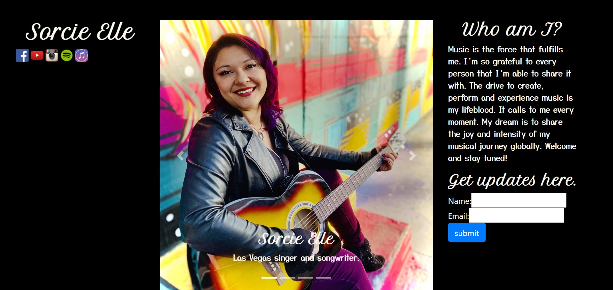

# SorcieElle

   link to [repository](http://github.com/devonP702/sorcieElle)
  Site deployed [here](https://guarded-brushlands-27514.herokuapp.com/)
  

  ## Table of Contents
* [Introduction](#introduction)
* [Installation](#installation)
* [Usage](#usage)
* [License](#license)
* [Contributing](#contributing)
* [Tests](#tests)
* [Questions](#questions)

  ## Introduction
  A homepage for Sorci Elle.

  ## Installation
  This Project runs on the Mern stack, with Axios

  ## Usage
  Great Template for homepages.
  ## License
  
  * I am using the MIT license. 
  
  
  ## Contributing
  This Code of Conduct is adapted from the [Contributor Covenant][homepage],
  version 2.0, available at
  https://www.contributor-covenant.org/version/2/0/code_of_conduct.html.
  ## Tests
  No Tests at this point
  ## Questions
  Thanks for taking the time to look at my project.
  If you would like to ask me any questions, please contact me.
  * On Github, User Name : devonP702
  * eMail me: devon.p702@gmail.com
